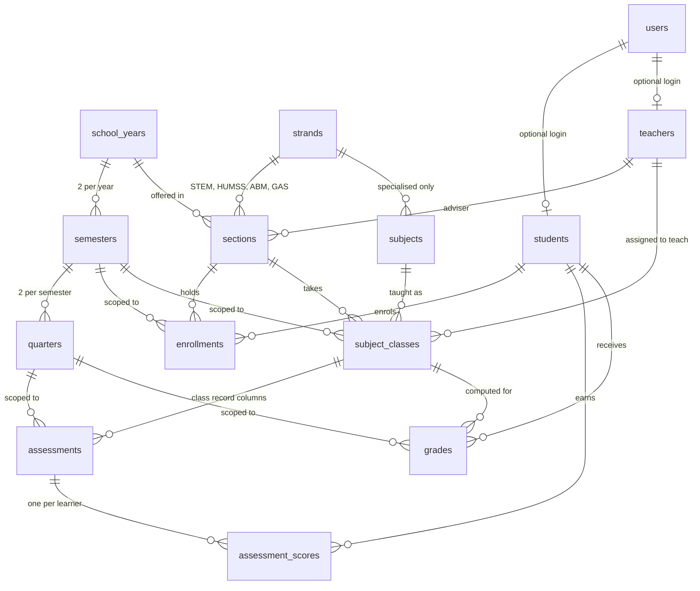

# Architecture

How the DCSA Portal is put together, and — more importantly — **why**.

This document is written for someone reading the codebase for the first time. It
assumes you can read code but not that you already know Laravel, Inertia or the DepEd
grading rules. Every design decision here had an alternative; where one was rejected,
the reason is written down.

- [The one-paragraph version](#the-one-paragraph-version)
- [How a request travels through the app](#how-a-request-travels-through-the-app)
- [The layers, and what belongs in each](#the-layers-and-what-belongs-in-each)
- [The database schema](#the-database-schema)
  - [The shape of it](#the-shape-of-it)
  - [Identity: users vs. students vs. teachers](#identity-users-vs-students-vs-teachers)
  - [Time: school year → semester → quarter](#time-school-year--semester--quarter)
  - [Structure: strands, sections, subjects](#structure-strands-sections-subjects)
  - [The two join tables that carry the whole system](#the-two-join-tables-that-carry-the-whole-system)
  - [The class record: assessments and scores](#the-class-record-assessments-and-scores)
  - [The grades table, and why it is deliberately redundant](#the-grades-table-and-why-it-is-deliberately-redundant)
  - [The supporting tables](#the-supporting-tables)
  - [Delete rules](#delete-rules)
- [The grading pipeline](#the-grading-pipeline)
- [Who is allowed to do what](#who-is-allowed-to-do-what)
- [Testing strategy](#testing-strategy)
- [Known trade-offs](#known-trade-offs)

---

## The one-paragraph version

The portal is a **Laravel 12 monolith** that renders **React** screens through
**Inertia**. There is no separate API: a controller hands a React page its props
directly, the way a Blade template would receive variables. The database is the heart
of the system — a normalised registry of the school (people, terms, sections,
subjects) plus one deliberately redundant table, `grades`, that caches the computed
result of the DepEd grading formula. The formula itself lives in small, pure PHP
classes with no database access, so it can be tested against the published DepEd
tables directly.

---

## How a request travels through the app

Take a teacher opening a class record.

```
Browser  GET /class-record/42?quarter=2
   │
   ▼
routes/web.php ──────────── matches the route, notes its middleware
   │
   ▼
Middleware, in order
   │  auth ..................... is anyone signed in?
   │  EnsureUserIsActive ....... has the registrar disabled this account since it
   │                             signed in? If so, end the session now.
   │  role:admin,teacher ....... is this user one of the two roles allowed here?
   ▼
ClassRecordController::show()
   │  authorizeClass() ......... a teacher may only open a class they are
   │                             assigned to; an admin may open any
   │  loads the section's learners, the quarter's assessment columns,
   │  and the cached grades row for each learner
   ▼
Inertia::render('grades/class-record', [...props])
   │
   ▼
resources/js/pages/grades/class-record.tsx
   │  receives those props as a typed React component prop
   ▼
Browser paints the class record
```

Two things are worth noticing.

**There is no API layer.** `Inertia::render` returns a JSON payload naming a React
component and its props. On a full page load the payload is embedded in the HTML; on
an in-app navigation it arrives over `fetch` and React swaps the page. That means a
prop is defined in exactly one place — the controller — instead of being defined by an
API resource, re-declared by a client-side fetch, and drifting apart over time.

**Authorisation happens twice, on purpose.** `role:` middleware answers the coarse
question ("may teachers use this route at all?"). `authorizeClass()` answers the fine
one ("may *this* teacher open *this* class?"). Route middleware alone could not
express the second, because it depends on the record being requested.

---

## The layers, and what belongs in each

```
app/
  Enums/       The vocabulary. UserRole, Track, SubjectType, GradeComponent.
               Just names and labels — no logic.

  Support/     The rules, as pure functions. No database, no HTTP, no framework.
               TransmutationTable  the DepEd 60–100 conversion table
               ComponentWeights    which WW/PT/QA split applies to a subject
               GradeDescriptor     "Outstanding", "Passed", the 75 passing mark
               TemporaryPassword   generating one-time passwords

  Services/    Orchestration. These read and write the database, and lean on
               Support/ for every actual rule.
               GradeCalculator     a class record ──► rows in `grades`
               AcademicRecord      rows in `grades` ──► a report card

  Models/      Eloquent models — one per table. Relationships and casts.

  Http/        The web edge. Controllers translate HTTP into service calls;
               middleware guards the door.
```

**Why keep `Support/` free of the database.** The grading rules are the part of this
system that must be provably correct — they decide whether a learner passes. A pure
class can be tested exhaustively and instantly: `TransmutationTableTest` walks all
10,001 possible initial grades from 0.00 to 100.00 and asserts each maps to the value
DepEd Order No. 8 s. 2015 Appendix B prescribes. That test would be unbearably slow if
transmutation needed a database round-trip, and it would be testing the database
rather than the rule.

**Why `Services/` exists at all**, instead of putting the logic in controllers. Grade
computation is triggered from several places — a teacher saving scores, a teacher
adding or deleting an assessment column, an admin editing a subject's weights. Each of
those has to produce identical results. One `GradeCalculator` used by all of them is
the only way to guarantee that.

---

## The database schema

### The shape of it



Read it in three bands:

1. **The calendar** (`school_years`, `semesters`, `quarters`) — *when*.
2. **The registry** (`users`, `students`, `teachers`, `strands`, `sections`,
   `subjects`) — *who* and *what*.
3. **The academic record** (`enrollments`, `subject_classes`, `assessments`,
   `assessment_scores`, `grades`) — *what actually happened*.

Everything below explains a decision in one of those bands.

---

### Identity: users vs. students vs. teachers

A `user` is a **login**. A `student` is a **person in the registry**. They are separate
tables, joined by a **nullable** `students.user_id`.

That nullable column is doing real work:

- **The registrar can enrol a learner before an account exists.** Enrolment happens in
  bulk at the start of a semester; issuing accounts is a separate act. If a login were
  mandatory, the registry could not be populated first.
- **Deleting an account must not erase the academic record.** The foreign key is
  `nullOnDelete`, so removing a user detaches the login and leaves the learner, their
  enrolments and their grades intact. A school's obligation to keep grades outlives any
  particular account.
- **The two have different natural keys.** A user is identified by email; a student is
  identified by their DepEd **LRN** (Learner Reference Number). Merging the tables
  would force one row to carry both, and would mean every teacher and learner needed
  an email address before they could exist.

The same reasoning applies to `teachers.user_id`.

`users.role` is a three-value enum (`admin`, `teacher`, `student`) rather than a roles
table with a pivot. There are exactly three roles, they are fixed by how a school
works, and no one holds two at once — a permissions system would be machinery with
nothing to do.

`users.is_active` exists so an account can be **disabled without being deleted**.
Deleting would break the `user_id` link to the academic record; disabling keeps the
history and still ends access — see [EnsureUserIsActive](#who-is-allowed-to-do-what).

---

### Time: school year → semester → quarter

Three tables, not one column, because **each level owns different facts**:

| Level | Owns |
|---|---|
| `school_years` | the date range; which year is currently active |
| `semesters` | which term (1 or 2); **enrolment attaches here** |
| `quarters` | which quarter (1–4); **the encoding lock attaches here** |

Senior High School in the Philippines runs two semesters a year, each with two
quarters. A learner enrols **per semester** and can legitimately change section
between the two, so `enrollments` points at a semester rather than a school year.
Grades are earned **per quarter**, so `grades` and `assessments` point at a quarter.
Flattening this into one `term` column would make both of those relationships
impossible to express.

Each level is protected by a composite unique key — `(school_year_id, term)` and
`(semester_id, number)` — so a year cannot accidentally sprout a third semester, or a
semester a third quarter.

**The lock lives on the quarter, not on each grade.**

```php
$table->boolean('is_locked')->default(false);
$table->timestamp('locked_at')->nullable();
$table->foreignId('locked_by')->nullable()->constrained('users')->nullOnDelete();
```

Closing a quarter is one `UPDATE` on one row, and it instantly freezes every class
record in that quarter — for a school with 128 learners across 24 subjects that is one
write instead of thousands. It is also **reversible**: an admin can reopen a quarter if
a correction is needed, which a per-grade "finalised" flag would make painful.
`locked_at` and `locked_by` record who closed it and when, because "who finalised these
grades?" is a question a registrar will eventually be asked.

---

### Structure: strands, sections, subjects

**`strands.track` is the column that matters.** A strand is STEM, HUMSS, ABM or GAS. A
*track* is the broader DepEd grouping above it (Academic, TVL, Sports, Arts & Design).
The grading weights depend on the **track**, not the strand:

| Applies to | WW | PT | QA |
|---|---|---|---|
| Core subjects, all tracks | 25% | 50% | 25% |
| Academic track — applied & specialised | 25% | 45% | 30% |
| TVL / Sports / Arts & Design — applied & specialised | 20% | 60% | 20% |

Storing `track` once on the strand means the four academic strands cannot drift apart
into different weights by accident. A section reaches its weights through
`section → strand → track`.

**`sections` is unique on `(name, school_year_id)`, not on `name` alone.** "12-STEM A"
exists every year and refers to a different group of learners each time. A global
unique constraint would mean renaming sections annually.

**`subjects.strand_id` is nullable.** Null means *offered to every strand* — which is
what a core subject like General Mathematics is. The alternative, a pivot table joining
every core subject to every strand, would be rows of pure noise.

**`subjects.ww_weight` / `pt_weight` / `qa_weight` are nullable.**

```php
// Optional per-subject override of the DepEd default weights (percent, must total 100).
$table->unsignedTinyInteger('ww_weight')->nullable();
```

Null means *use the DepEd default for this subject type and track*. A value means *a
locally approved scheme applies here*. They are nullable rather than pre-filled with
the defaults for a specific reason: it keeps "never set" distinguishable from
"deliberately set to the same numbers as the default". If DepEd ever revises the
defaults, every subject that never overrode them picks up the new values
automatically, and the ones that were deliberately customised stay put.
`ComponentWeights::resolve()` also ignores an override that does not total 100, so a
half-finished edit falls back to the DepEd rule rather than producing wrong grades.

---

### The two join tables that carry the whole system

**`enrollments` — a learner in a section for a semester.**

```php
$table->unique(['student_id', 'semester_id']);   // one section per semester
```

This is the single most load-bearing constraint in the schema. It is what makes "who
is in this class?" answerable at all: `SubjectClass::students()` finds the learners
enrolled in the class's section for the class's semester. Without the constraint a
learner could appear in two sections and would then show up twice in one class record,
with two different sets of grades and no way to say which counted.

Note it is `(student_id, semester_id)` and **not** `(student_id, section_id,
semester_id)`. The looser version would permit exactly the duplicate this is meant to
prevent.

**`subject_classes` — one subject, taught to one section, for one semester, by one
teacher.**

```php
$table->unique(['subject_id', 'section_id', 'semester_id']);
```

This is the unit a teacher keeps a class record for, and it is the hinge the whole
academic record hangs from. It is a table rather than a plain many-to-many pivot
because the pairing **carries its own data** (`teacher_id`, `schedule`, `room`) and
**owns child records** (`assessments`, `grades`).

`teacher_id` is nullable so the registrar can build the schedule before every teaching
assignment is settled — a real sequencing constraint at the start of a semester.

---

### The class record: assessments and scores

An `assessment` is **one column of the paper DepEd class record**: "Written Work 1",
"Performance Task 3", the quarterly exam.

```php
$table->enum('component', ['written_work', 'performance_task', 'quarterly_assessment']);
$table->unsignedSmallInteger('highest_possible_score');   // HPS
$table->unsignedSmallInteger('position')->default(0);
$table->index(['subject_class_id', 'quarter_id', 'component']);
```

`highest_possible_score` sits on the **assessment**, not on each score, because the HPS
is a property of the quiz — a 20-item quiz is out of 20 for everyone. Repeating it per
learner would let one learner's copy disagree with another's.

`position` exists because column order is meaningful on a class record and must survive
being reordered; it is not implied by `id`.

The index is `(subject_class_id, quarter_id, component)` because that is precisely the
query the class record screen runs — every assessment for this class, this quarter,
grouped by component.

**`assessment_scores.score` is nullable, and that nullability is load-bearing.**

```php
$table->decimal('score', 6, 2)->nullable();   // null = not yet encoded
$table->unique(['assessment_id', 'student_id']);
```

`null` means *not encoded yet*. `0` means *sat the quiz and scored zero*. Collapsing
those two would be the most damaging bug this system could have: a teacher who has
created a column but not yet typed the scores would see the whole class failing. The
calculator enforces the distinction explicitly:

```php
// Only assessments this learner actually has an encoded score for count
// toward the totals; an assessment still being encoded must not silently
// read as a zero.
->filter(fn (array $row) => $row['score'] !== null);
```

`decimal(6,2)` rather than a float, because grades are money-like: exact decimal
arithmetic, no binary rounding surprises when a score is summed a hundred times.

---

### The grades table, and why it is deliberately redundant

Every column in `grades` is **derived** — it can be recomputed from
`assessment_scores` alone. Storing it breaks third normal form on purpose. Three
reasons:

**1. Reading grades is far more common than writing them.** A report card, a student
dashboard, the admin's school-wide grade overview and the section grade sheet all need
finished grades. Without the cache, opening one report card would mean re-reading every
score the learner has, for every subject, and re-running the formula. The admin
overview would do that for all 128 learners at once.

**2. It cannot drift, because it is never updated by hand.** `GradeCalculator` writes
it via `updateOrCreate` after every change to a score or an assessment column. The
cache is a pure function of the scores, recomputed at each write — not a value someone
edits.

**3. It stores the working, not just the answer.**

```php
$table->decimal('ww_score', 7, 2)->default(0);   // raw total
$table->decimal('ww_total', 7, 2)->default(0);   // total HPS
$table->decimal('ww_ps',    6, 2)->default(0);   // percentage score
$table->decimal('ww_ws',    6, 2)->default(0);   // weighted score
// ... the same four for pt_ and qa_
$table->decimal('initial_grade', 6, 2)->default(0);
$table->unsignedTinyInteger('final_grade')->nullable();   // transmuted, 60..100
```

This is the real reason the table is wide. The DepEd class record and the SF9 report
card are **prescribed forms that must show every intermediate figure** — raw score,
percentage score, weighted score, initial grade, transmuted grade. A cache holding only
`final_grade` could not reproduce them, and a grade nobody can audit is not much use to
a registrar defending it to a parent.

**`final_grade` is nullable, and that is the "not finished yet" signal.** It stays null
until all three components have at least one encoded score:

```php
$finalGrade = $allComponentsStarted ? TransmutationTable::transmute($initialGrade) : null;
```

A quarter where only the written work has been encoded is *incomplete*, not *failed*.
The intermediate component figures are still stored and displayed, so a teacher watches
the record fill up — but no final grade is asserted until there is one to assert.

The unique key is `(student_id, subject_class_id, quarter_id)`, explicitly named
`grades_unique`:

```php
$table->unique(['student_id', 'subject_class_id', 'quarter_id'], 'grades_unique');
```

The name is given by hand because Laravel would otherwise generate
`grades_student_id_subject_class_id_quarter_id_unique` — 52 characters, which fits
MySQL's 64-character identifier limit but is unreadable in an error message. When a
duplicate-key violation surfaces, `grades_unique` says what went wrong at a glance.

---

### The supporting tables

**`settings` is a key/value store with a JSON value column.**

```php
$table->string('key')->unique();
$table->json('value')->nullable();
```

It holds the school's name, address, division, logo and similar details a registrar
edits. A conventional table with one column per setting would need a migration every
time a new field appears; that is a poor trade for data that is read a handful of times
per page and never queried by value. Anything that *is* queried by value — an academic
term, a lock state — has a real column on a real table instead.

**`activity_logs` uses a polymorphic subject.**

```php
$table->string('action');          // "student.created"
$table->string('description');
$table->nullableMorphs('subject'); // the record acted upon
$table->index('created_at');
```

`nullableMorphs` gives `subject_type` + `subject_id`, so one log table can point at a
student, a subject class, a quarter — anything — without a foreign key column per type
or a join table per type. It is nullable because some actions have no single subject.
The index is on `created_at` because the log is only ever read newest-first for the
dashboard's recent-activity list.

**`events`** carries an `audience` enum (`all` / `teachers` / `students`) so one
calendar can serve every dashboard, filtered at query time.

---

### Delete rules

The pattern is consistent and worth stating explicitly, because it encodes what the
school considers disposable:

**`cascadeOnDelete` — down the academic hierarchy.** Deleting a semester takes its
quarters; deleting a subject class takes its assessments; deleting an assessment takes
its scores. A child has no meaning without its parent — an assessment score belonging to
no assessment is not a record, it is debris.

**`nullOnDelete` — every reference to a person.** Deleting a user detaches the login
from the student or teacher. Deleting a teacher clears `sections.adviser_id` and
`subject_classes.teacher_id` rather than destroying the section or the class. A teacher
leaving the school must never take a section's grades with them.

The rule of thumb: **cascade along "is part of", null along "is associated with".**

---

## The grading pipeline

DepEd Order No. 8, s. 2015 defines the computation. The code follows it step for step.

```
raw score ──► Percentage Score ──► Weighted Score ──► Initial Grade ──► Transmuted Grade
             (raw ÷ HPS × 100)     (PS × weight)      (sum of the WS)   (60–100 scale)
```

Worked through one learner's written work, at the 25% weight for a core subject:

| Step | Where | Example |
|---|---|---|
| Sum the encoded scores and their HPS | `GradeCalculator::figuresFor` | 46 out of 50 |
| Percentage Score = raw ÷ total × 100 | same | 92.00 |
| Weighted Score = PS × weight ÷ 100 | same | 92.00 × 25% = 23.00 |
| Initial Grade = WW + PT + QA weighted scores | same | 23.00 + 44.50 + 22.75 = 90.25 |
| Transmuted Grade | `TransmutationTable::transmute` | 90.25 → **93** |
| Descriptor and pass/fail | `GradeDescriptor` | Outstanding, passed |

Above an initial grade of 60.00 each transmuted point spans 1.6 initial points; below
it, 4.0 — which is why a 90.25 becomes a 93, and why the table is transcribed as
explicit ranges rather than computed with a formula. Transcribing it makes it directly
checkable against the published appendix.

Then, one level up in `AcademicRecord`:

- **Semestral final grade** = the mean of the semester's two quarterly grades.
- **General average** = the mean of the semestral final grades across subjects.
- **Passing** = 75.

**When recomputation happens.** `GradeCalculator::computeClass` runs after any write
that could change a figure: saving scores, adding an assessment column, editing one,
deleting one. Score writes happen inside a `DB::transaction`, and the recompute follows
it. There is no queue and no scheduled job — grades are correct by the time the
response returns, which is what a teacher watching the grade change as they type
requires.

One small guard worth knowing about, in `saveScores`:

```php
// A score above the highest possible score is a typo, not a bonus.
$score = min((float) $row['score'], (float) $assessment->highest_possible_score);
```

---

## Who is allowed to do what

Four mechanisms, each covering what the others cannot:

| Mechanism | Question it answers | Where |
|---|---|---|
| `auth` middleware | Is anyone signed in? | Laravel |
| `EnsureUserIsActive` | Has this account been disabled *since* it signed in? | `app/Http/Middleware/` |
| `role:admin,teacher` | May this role use this route at all? | `EnsureUserHasRole` |
| `authorizeClass()` | May *this* teacher open *this* class? | `ClassRecordController` |
| `assertQuarterOpen()` | Is this quarter still open for encoding? | `ClassRecordController` |

**Why `EnsureUserIsActive` runs on every request** rather than only at sign-in: a
registrar disabling an account expects it to take effect now. Checking only at sign-in
would leave an already-open session alive for as long as the user kept clicking. The
middleware logs the session out, invalidates it and regenerates the CSRF token on the
next request.

**Why the quarter lock is enforced in the controller and not only in the UI.** The
class record hides its inputs when `canEdit` is false, but that is a courtesy, not a
control — a hidden form is still postable. `assertQuarterOpen()` re-checks on the
server for every write:

```php
if (Quarter::findOrFail($quarterId)->is_locked) {
    abort(403, 'This quarter has been closed by the administrator. Grades can no longer be edited.');
}
```

**Sign-up is disabled by design.** Every account is issued by the registrar, with a
random one-time password shown once at creation (`Support/TemporaryPassword`). Sign-in
addresses follow a predictable pattern (`first.last.id@dcsa.edu.ph`), so they are
guessable — the one-time password, not the address, is what protects an account.

---

## Testing strategy

131 tests, run against an **in-memory SQLite database** configured in `phpunit.xml`.
That choice is deliberate: the suite needs no database server, never touches your MySQL
data, and starts from a known-empty schema every time. The trade-off is that it does
not exercise MySQL-specific behaviour; the schema deliberately sticks to portable
column types so this stays safe.

The coverage is weighted towards the parts where being wrong matters most:

| Suite | What it pins down |
|---|---|
| `Unit/TransmutationTableTest` | every band boundary, and all 10,001 possible initial grades |
| `Unit/ComponentWeightsTest` | the DepEd weight matrix and the override rules |
| `Feature/GradeCalculatorTest` | the full computation against hand-worked figures |
| `Feature/QuarterLockTest` | that a closed quarter really cannot be written to |
| `Feature/Admin/*` | every registry write path *and its authorisation* |
| `Feature/Auth/DisabledAccountTest` | that disabling ends a live session |
| `Feature/PortalSmokeTest` | every screen opens, as each role |

`tests/Concerns/BuildsSchool.php` builds a miniature school — year, semester, quarters,
strand, section, subject, class, learners — so a test can state its scenario in a line
or two instead of thirty lines of setup.

---

## Known trade-offs

Written down so the next reader does not mistake them for oversights.

**One school year at a time.** `school_years.is_active` and `semesters.is_active`
assume a single current term. Multi-year historical reporting works (the data is all
there, keyed by year), but the dashboards and pickers are built around the active one.

**`grades` is a cache with no invalidation check.** It is correct because every write
path calls `GradeCalculator`. A future write path that forgets to would leave stale
rows, and nothing would detect it. If the app grows more write paths, a model observer
on `AssessmentScore` would be the sturdier design.

**Recomputation is synchronous and recomputes the whole class.** Saving one score
recomputes every learner in that class for that quarter. At a section's ~45 learners
this is comfortably fast and keeps the code simple. At district scale it would want to
become a queued job.

**No soft deletes.** Deleting a subject class really deletes its assessments and
grades. The activity log records that it happened, but the data does not come back.
This is fine for a registrar-operated system with backups and is a genuine risk without
them.

**The activity log is written by explicit calls**, not by model events, so an action
that forgets to call `ActivityLog::record` simply is not logged. It is a convenience
feed for the dashboard, not an audit trail to be relied on for compliance.
